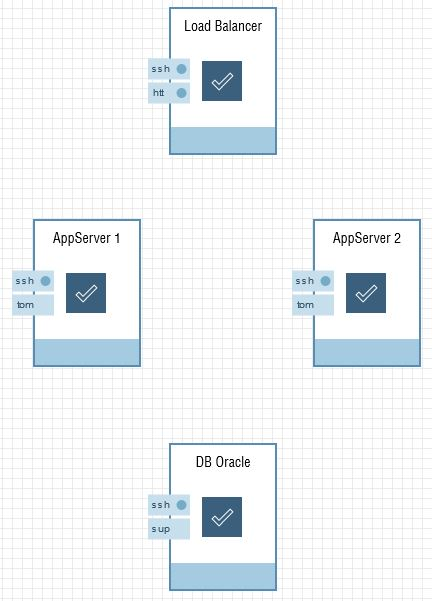

# CI/CD with Ravello
Ed Shnekendorf and Brian Leonard, Cloud Platform Architects

----------


There are multiple approaches to CI/CD Nirvana. The right approach will depend on:

1. What you're trying to automate (monolith, mircoservices)
1. Your existing skill set with configuration management and provisioning tools such as [Chef](https://www.chef.io/chef/), [Puppet](https://puppet.com/), [Ansible](https://www.ansible.com/) and [Terraform](https://www.terraform.io/)
1. Your desire and time to learn
1. How heavily invested your organization is in VMWare/KVM

With regards to the configuration management and provisioning tools, the results of which are often referred to as [Infrastructure as Code](https://en.wikipedia.org/wiki/Infrastructure_as_Code)(IaC), you may find that [Ravello](https://www.ravellosystems.com/) provides a "shortcut" to achieving the same results.

Ravello provides a graphical, declarative way to to define your configuration, which can then be blueprinted for easy provisioning. This article and associated resources provide an example of how Ravello can fit into your CI/CD narrative when using it as IaC.

## The Application (Game Shop)
For this example we've settled on a 3-tier web application called the Game Shop, which is a store front for video games. The application, which is fronted by an NGINX load-balancer, runs on Tomcat 7 and uses the Oracle 12c database. Represented in Ravello it appears as follows:



### Some Notes


- The private IP of the database is 10.0.0.8
- An SSH public key has been added to the VMs


## The Build Tool (Jenkins)
For the purpose of this exercise, Jenkins has been installed from [Bitnami](https://bitnami.com/stack/jenkins) as a separate Ravello application, however any installation of Jenkins should suffice. The following specific actions were taken to configure our instance of Jenkins to work with Ravello:

1. Python and its pip package manager were installed:

    	# curl "https://bootstrap.pypa.io/get-pip.py" -o "get-pip.py"; sudo python get-pip.py

1. The [Ravello Python SDK](https://github.com/ravello/python-sdk) was installed:

		$ sudo pip install ravello_sdk

1. A `/home/oracle/Ravello` directory was created and populated with the contents of this [ravello](.) directory.

1. A private key file for the public key that you associated with your Ravello VMs was put in the `/home/oracle` directory

2. Jenkins was configured by creating a free-form build job with the following information:

    3. A **Project Name** of *GameRentals*.  The **This Project is Parameterized** checkbox is activated and a String parameter of *BLUEPRINT_NAME* is added.  The default value is set to *Ravello CI/CD Demo Blueprint v4*.  The parameter is expected by the Ravello deployment scripts.
    3. The **Build Triggers** Tab is configured to **Poll SCM** every minute.  Alternatively, you can configure a post-commit hook.
    3. The **Source Control** tab is configured for **Git** access.  The **Repository URL** should point to this repository (or preferably your fork of it).  In either case, you will want write access to trigger the builds off commits.
    4.  The **Build** tab should have 3 build actions.  The first two should be **Maven** build actions and the third should be a **Execute Shell** Action.  The Goals/Commands are below.  In our sample db_name = pdborcl.localdomain, db_user = webapp, db_password = webapp    
        
        1. FIRST BUILD ACTION
	```
        mvn install:install-file -DgroupId=com.oracle.jdbc -DartifactId=ojdbc7 -Dversion=12.1.0.2 -Dpackaging=jar -Dfile=ojdbc7.jar
	```

        2. SECOND BUILD ACTION
	```
	mvn clean package -Ddb.ip=10.0.0.8 -Ddb.name=<db name> -Ddb.user=<db user> -Ddb.pass=<db password> 
	```
	
        3. THIRD BUILD ACTION
	```
        cd /home/oracle/Ravello
		./ravelloPublishDeploy.sh "$BLUEPRINT_NAME" "$BUILD_TAG-$GIT_COMMIT"
	```

6. [set-creds](set-creds) was run to store our Ravello credentials in an encrypted file to be used by the Ravello SDK. The user must have access to the blueprint passed in via the *BLUEPRINT_NAME* paramter.  This is run from the console of the Jenkins VM as a one-time action (e.g. *python /home/oracle/Ravello/set-creds*)


## The Magic (Ravello Python SDK)
Ravello has a powerful powerful [Python SDK](https://github.com/ravello/python-sdk) (backed by an equally powerful [REST API](https://www.ravellosystems.com/ravello-api-doc/)) and our intent is to use it do to the following:

1. Authenticate to Ravello
2. Publish an Application from a Blueprint
3. Start the Application with a 60 minute expiration time
4. Wait for the application start-up to complete
5. Get the IP addresses of the Tomcat servers
6. Copy the freshly built application to the Tomcat servers

While the above could be achieved entirely in Python, we elected to use a Bash script, [ravelloPublishDeploy.sh](ravelloPublishDeploy.sh), to make calls out to Python. We found the Bash script to be simple to read and edit to meet our needs, while the more static Python scripts would do the heavy lifting behind the scenes. Many of the Python scripts used were lifted directly from the [examples](https://github.com/ravello/python-sdk/tree/master/examples) provided by the SDK.


